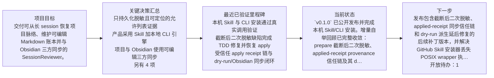
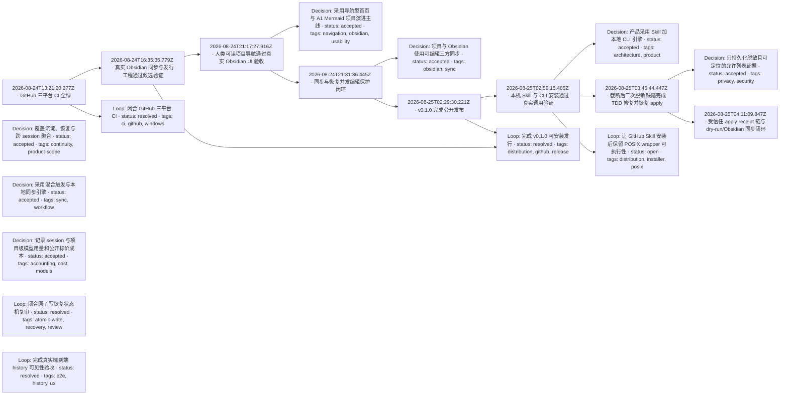

# Project evolution

This file is derived from the accepted project ledger. Manual edits are overwritten on the next accepted render.

## Recovery mainline

## Causal evolution

## Project relationships

```mermaid
graph TD
  project_c45e22b0debf["Project: project-269b8cab6cbf69dd · goal: 交付可从长 session 恢复项目脉络、维护可编辑 Markdown 账本并与 Obsidian 三方同步的 SessionReviewer。"]
  session_b7e0d95aa083["Session: 01a02971-61d6-7251-bdcf-f999230f961d"]
  decision_5dd62002d6a4["Decision: 覆盖沉淀、恢复与跨 session 聚合 · status: accepted · tags: continuity, product-scope"]
  decision_04220dd8a2c5["Decision: 项目与 Obsidian 使用可编辑三方同步 · status: accepted · tags: obsidian, sync"]
  decision_29c068ff6e43["Decision: 采用导航型首页与 A1 Mermaid 项目演进主线 · status: accepted · tags: navigation, obsidian, usability"]
  decision_078fe83339c8["Decision: 采用混合触发与本地同步引擎 · status: accepted · tags: sync, workflow"]
  decision_ed466f029681["Decision: 记录 session 与项目级模型用量和公开标价成本 · status: accepted · tags: accounting, cost, models"]
  decision_9cd2795959d6["Decision: 只持久化脱敏且可定位的允许列表证据 · status: accepted · tags: privacy, security"]
  decision_757157859a2b["Decision: 产品采用 Skill 加本地 CLI 引擎 · status: accepted · tags: architecture, product"]
  loop_98b011131a63["Loop: 闭合原子写恢复状态机复审 · status: resolved · tags: atomic-write, recovery, review"]
  loop_a65fd34793b2["Loop: 闭合 GitHub 三平台 CI · status: resolved · tags: ci, github, windows"]
  experiment_6da5c21c7d38["Next experiment: 无需继续；保留 CI 作为后续发布门禁。"]
  loop_3012e18a6015["Loop: 完成真实端到端 history 可见性验收 · status: resolved · tags: e2e, history, ux"]
  loop_7df6913742a9["Loop: 让 GitHub Skill 安装后保留 POSIX wrapper 可执行性 · status: open · tags: distribution, installer, posix"]
  blocker_4bc7f18c06ca["Blocker: GitHub Skill 安装器的下载或落盘过程未保留 POSIX 执行位。"]
  experiment_2d83e054f913["Next experiment: 评估将 Skill 调用改为显式 sh wrapper，或提供可验证的安装后 chmod 机制，并在干净 macOS/Linux 环境复验。"]
  loop_4ac845327a15["Loop: 完成 v0.1.0 可安装发行 · status: resolved · tags: distribution, github, release"]
  blocker_59a6ee3695cc["Blocker: 无；发布完成条件已满足。"]
  experiment_266258fa93db["Next experiment: 监测首批安装与使用反馈；运行时修复使用后续语义化版本，不移动 v0.1.0 标签。"]
  loop_4ac845327a15 --> blocker_59a6ee3695cc
  loop_4ac845327a15 --> experiment_266258fa93db
  loop_7df6913742a9 --> blocker_4bc7f18c06ca
  loop_7df6913742a9 --> experiment_2d83e054f913
  loop_a65fd34793b2 --> experiment_6da5c21c7d38
  project_c45e22b0debf --> decision_04220dd8a2c5
  project_c45e22b0debf --> decision_078fe83339c8
  project_c45e22b0debf --> decision_29c068ff6e43
  project_c45e22b0debf --> decision_5dd62002d6a4
  project_c45e22b0debf --> decision_757157859a2b
  project_c45e22b0debf --> decision_9cd2795959d6
  project_c45e22b0debf --> decision_ed466f029681
  project_c45e22b0debf --> loop_3012e18a6015
  project_c45e22b0debf --> loop_4ac845327a15
  project_c45e22b0debf --> loop_7df6913742a9
  project_c45e22b0debf --> loop_98b011131a63
  project_c45e22b0debf --> loop_a65fd34793b2
  project_c45e22b0debf --> session_b7e0d95aa083
```

