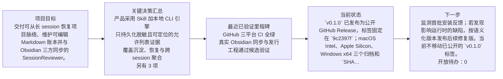

# SessionReviewer
## 项目导航

<!-- session-reviewer:generated=v1;owner=navigation;section=项目导航 -->

### 项目总览

- **项目目标：** 交付可从长 session 恢复项目脉络、维护可编辑 Markdown 账本并与 Obsidian 三方同步的 SessionReviewer。
- **最后验证：** \`v0.1.0\` 已发布为公开 GitHub Release，标签固定在 \`9c2397f\`；macOS Intel、Apple Silicon、Windows x64 三个归档和 \`SHA256SUMS\` 均可下载并已在下载后复验。main 推送 CI、Release 工作流和标签 CI 均完成；标签 CI 首次运行暴露了一个墙钟计时测试抖动，Intel 失败任务重跑全绿，随后已把该门禁改为确定性的输出等价断言。真实 Project/Obsidian 同步仍为 14/14，派生文件 16，重复 dry-run 零操作。
- **下一步：** 监测首批安装反馈；若发现影响运行时的缺陷，按语义化版本发布后续修复版。当前不移动已公开的 \`v0.1.0\` 标签。

### 项目演进主线

### 当前风险、阻塞与开放待办

- Windows x64 已交叉构建并由既有 CI 原生验证，但本轮没有 Windows 10/11 实机 UI 验收
- v0.1.0 标签包含原计时型回归测试；该测试曾在 Intel 标签 CI 偶发失败后重跑通过，确定性替代只存在于后续 main，不影响发布二进制

- 开放待办：0 项

### 最近三项变化

- 真实 Obsidian 同步与发行工程通过候选验证：真实 Vault 三方同步达到零 pending、零 conflict、零 error；三平台归档、校验和、版本元数据和同步中断恢复均通过候选验证，并确定 Apache-2.0 许可。
- GitHub 三平台 CI 全绿：macOS Intel、macOS Apple Silicon 和 Windows x64 目标全部通过，Windows 还完成 20 次原生替换压力测试。

### 项目用量与成本

- 总耗时：2d 5h 12m 35s 426ms (191555426 ms)
- Token 总量：455,614,123
- 总成本：$225.264344800 USD
- gpt-5.6-sol：455,614,123 Token (100.0000%)；$225.264344800 USD (100.0000% 成本)

### 快速入口

- [当前状态](<current-state.md>)
- [完整时间线](<evolution-timeline.md>)
- [完整项目演进图](<diagrams/project-evolution.md>)
- [决策索引](<decisions/00-目录说明.md>)
- [待办索引](<open-loops/00-目录说明.md>)
- [Session 索引](<sessions/00-目录说明.md>)

## Project accounting

<!-- session-reviewer:generated=v1;owner=navigation;section=Project accounting -->

- Total session duration: 2d 5h 12m 35s 426ms (191555426 ms)
- Total tokens: 455614123
- Total cost: $225.264344800 USD
- `gpt-5.6-sol`: 455614123 tokens (100.0000%); $225.264344800 USD (100.0000% of cost)
