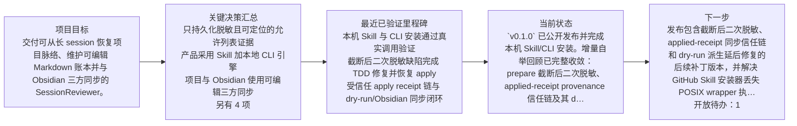

# SessionReviewer
## 项目导航

<!-- session-reviewer:generated=v1;owner=navigation;section=项目导航 -->

### 项目总览

- **项目目标：** 交付可从长 session 恢复项目脉络、维护可编辑 Markdown 账本并与 Obsidian 三方同步的 SessionReviewer。
- **最后验证：** \`v0.1.0\` 已公开发布并完成本机 Skill/CLI 安装。增量自举回顾已完整收敛：prepare 截断后二次脱敏、applied-receipt provenance 信任链及其 dry-run 派生延后边界均通过 TDD 修复。全仓测试、vet、module tidy、关键包 race、Windows amd64 与 macOS amd64 交叉测试构建均通过；真实 Project/Obsidian 为 16/16 in-sync，零冲突、零 malformed、零 blocked，重复 dry-run 与递归 diff 均为零。三项本地修复尚未发布。
- **下一步：** 发布包含截断后二次脱敏、applied-receipt 同步信任链和 dry-run 派生延后修复的后续补丁版本，并解决 GitHub Skill 安装器丢失 POSIX wrapper 执行位的兼容问题；不移动已公开的 v0.1.0 标签。

### 项目演进主线

### 当前风险、阻塞与开放待办

- Windows x64 已交叉构建并由既有 CI 原生验证，但本轮没有 Windows 10/11 实机 UI 验收
- v0.1.0 标签包含原计时型回归测试；该测试曾在 Intel 标签 CI 偶发失败后重跑通过，确定性替代只存在于后续 main，不影响发布二进制
- 已发布 v0.1.0 尚不包含本轮三项修复
- GitHub Skill 安装器会把 POSIX wrappers 从 0755 落盘为 0644，其他用户可能需要手工 chmod

- 开放待办：1 项

### 最近三项变化

- 受信任 apply receipt 链与 dry-run/Obsidian 同步闭环：完整 applied-receipt 链只在 Vault 未偏离 Base 时桥接受信任边界；dry-run 对待写 Base 正确延后派生规划，真实 16/16 同步、全仓/race/vet 与 Windows/macOS 交叉门禁全部通过。
- 截断后二次脱敏缺陷完成 TDD 修复并恢复 apply：prepare 截断后新形成高熵候选导致 apply 拒绝的问题已通过失败用例、最小修复、重生成安全 packet 和成功 apply 闭环。
- 本机 Skill 与 CLI 安装通过真实调用验证：v0.1.0 Skill 和 CLI 已安装；checkpoint、resume、sync status 与 dry-run 均真实运行成功，本机 wrapper 执行位已恢复。

### 项目用量与成本

- 总耗时：2d 15h 39m 52s 389ms (229192389 ms)
- Token 总量：573,072,332
- 总成本：$291.191795200 USD
- gpt-5.6-sol：573,072,332 Token (100.0000%)；$291.191795200 USD (100.0000% 成本)

### 快速入口

- [当前状态](<current-state.md>)
- [完整时间线](<evolution-timeline.md>)
- [完整项目演进图](<diagrams/project-evolution.md>)
- [决策索引](<decisions/00-目录说明.md>)
- [待办索引](<open-loops/00-目录说明.md>)
- [Session 索引](<sessions/00-目录说明.md>)

## Project accounting

<!-- session-reviewer:generated=v1;owner=navigation;section=Project accounting -->

- Total session duration: 2d 15h 39m 52s 389ms (229192389 ms)
- Total tokens: 573072332
- Total cost: $291.191795200 USD
- `gpt-5.6-sol`: 573072332 tokens (100.0000%); $291.191795200 USD (100.0000% of cost)
