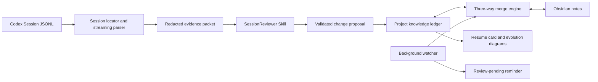

# SessionReviewer Design

- Status: approved
- Date: 2026-08-22
- Target: Codex Desktop on macOS and Windows
- Decision: build a Codex Skill backed by a deterministic local Go engine

## 1. Problem

Long-running Codex sessions can span several days and many iterations. When work resumes later, the user may remember the latest files but no longer remember:

- how the original goal changed;
- why one approach was selected over another;
- which rejected approaches must not be repeated;
- which statements were verified and which were only inferred;
- where work stopped and what the smallest useful next action is;
- how several sessions together produced the current project state.

A normal chat summary is insufficient. It tends to flatten causality, omit rejected paths, lose evidence, and become stale after the next interaction. Context compaction also solves continuation rather than human inspection: official OpenAI documentation describes compacted items as opaque and designed for continuation, not inspection.

SessionReviewer will turn local Codex session records into a durable, evidence-backed project knowledge ledger that remains editable in both the code repository and Obsidian.

## 2. Goals

SessionReviewer must support all three usage levels:

1. Review or checkpoint the current long session.
2. Restore project context after an interruption of hours or days.
3. Aggregate the evolution of one project across multiple sessions.

It must also:

- produce readable Markdown with Mermaid diagrams;
- preserve decisions, rejected alternatives, milestones, failures, open loops, and next actions;
- attach provenance to important conclusions;
- process sessions incrementally instead of repeatedly summarizing the whole log;
- support editable project and Obsidian copies with conflict-safe bidirectional synchronization;
- keep raw session data local;
- redact likely credentials and sensitive runtime data;
- work without a separately configured OpenAI API key;
- provide complete manual workflows when the background watcher is disabled;
- support both macOS and Windows in the first public release.

## 3. Non-goals

The first release will not provide:

- an independent desktop GUI;
- an Obsidian community plugin;
- a cloud service or team collaboration server;
- automatic Git commits, pushes, resets, or rollbacks;
- unattended model calls from the background watcher;
- semantic interpretation of hidden reasoning, system prompts, developer instructions, or encrypted compaction items;
- a mobile runtime for the SessionReviewer engine.

Mobile Obsidian edits may still participate after the user's existing vault synchronization brings them back to a Mac or Windows machine running SessionReviewer.

## 4. Selected Approach

### 4.1 Alternatives considered

#### Skill only

A pure Skill could locate a session, ask the model to summarize it, and write Markdown. This is suitable for an output-format prototype but is not reliable for very large sessions, cannot maintain deterministic cursors, and cannot synchronize Obsidian while Codex is inactive.

#### Skill plus local engine — selected

The Skill interprets intent and performs semantic synthesis. A local engine performs deterministic parsing, redaction, indexing, schema validation, file synchronization, and conflict handling. This separates model judgment from state integrity.

#### Desktop application or Obsidian plugin

A dedicated application could provide a richer visual browser, but it would still require the same extraction, indexing, and synchronization foundation. Building it first would add UI and distribution cost before the data model is proven.

### 4.2 Delivery order

The product is delivered in four dependent layers:

1. `review`: review a current or selected session.
2. `checkpoint` and `resume`: maintain incremental state and restore context.
3. `sync`: synchronize project and Obsidian edits with three-way merge.
4. `history`: aggregate project evolution across sessions.

Windows support is a release gate across these layers, not a later optional port.

## 5. Architecture



The system has five major boundaries.

### 5.1 Local CLI engine

`session-reviewer` locates sessions, streams JSONL, normalizes events, tracks cursors, redacts sensitive values, identifies projects, validates model proposals, renders ledger documents, indexes projects, and synchronizes files.

The engine does not make open-ended semantic decisions.

### 5.2 SessionReviewer Skill

The Skill recognizes natural-language intents such as "save a checkpoint", "where did I stop?", and "explain how this project evolved". It asks the local engine for a bounded evidence packet, classifies its meaning, and returns a structured change proposal.

The Skill does not directly consume an entire large JSONL file or overwrite ledger files.

### 5.3 Project knowledge ledger

The project ledger is the durable, Git-friendly knowledge record:

```text
docs/session-review/
├── project-overview.md
├── current-state.md
├── evolution-timeline.md
├── decisions/
├── open-loops/
├── sessions/
├── diagrams/
└── sync-conflicts/
```

After a successful synchronization, Obsidian edits become normal project Markdown changes and can be reviewed, committed, reverted, or branched with the code.

### 5.4 Local machine state

Machine-only state is not committed to the project.

macOS default:

```text
~/.local/share/session-reviewer/
├── config.toml
├── index.sqlite
└── projects/<project-id>/
    ├── cursors/
    ├── merge-bases/
    ├── queue/
    └── locks/
```

Windows default:

```text
%LOCALAPPDATA%\SessionReviewer\
├── config.toml
├── index.sqlite
└── projects\<project-id>\
    ├── cursors\
    ├── merge-bases\
    ├── queue\
    └── locks\
```

The SQLite index is an optimization and can be rebuilt from session metadata and project Markdown. Merge bases and cursors are machine state and must not be inferred from rendered diagrams.

### 5.5 Obsidian view

The default mapping is:

```text
<Vault>/Projects/<project-name>/Session Review/
```

Obsidian is a first-class editable view, not a read-only export. The project ledger remains the durable repository copy, while the three-way merge base determines how edits from either location are incorporated.

## 6. Session Discovery and Project Identity

### 6.1 Session roots

The engine discovers the Codex sessions directory from explicit configuration first, then from the local Codex home/configuration, and finally from the conventional `.codex/sessions` location under the user profile. `--sessions-root` always overrides discovery.

Discovery must support Unicode paths and Windows path separators. It must not assume that a drive letter or user profile remains unchanged across machines.

### 6.2 Current session

The current session is resolved using available thread/session identifiers. If they are unavailable, the engine matches recent session metadata against the current working directory and start time. Ambiguous matches require an explicit selection; the engine must not silently choose between two plausible active sessions.

### 6.3 Project identity

Project association uses, in order:

1. a stored `project_id`;
2. normalized Git remote identity;
3. Git common-directory identity shared by worktrees;
4. repository root path;
5. configured path aliases;
6. explicit user confirmation.

A session that changes working directories is segmented by project context. Events are not assigned to a second project merely because a tool read a file there. Ambiguous cross-project events remain unassigned until confirmed.

## 7. Evidence Extraction and Privacy

### 7.1 Included evidence

The parser may extract:

- user goals and corrections;
- assistant conclusions presented to the user;
- tool invocation metadata;
- bounded summaries of tool results;
- file changes, Git state, test results, and verification outcomes;
- timestamps, working-directory changes, and session relationships.

### 7.2 Excluded content

The parser must exclude:

- hidden reasoning items;
- system and developer instructions;
- encrypted or opaque compaction payloads;
- full environment dumps;
- raw credentials and likely secrets;
- large raw tool outputs when a bounded evidence summary is sufficient.

Compaction summaries may be used as navigation hints only when readable. They are not independent proof of a project fact.

### 7.3 Evidence reference

Each retained evidence item has a stable locator:

```json
{
  "session_id": "01a02971-...",
  "item_id": "msg_...",
  "timestamp": "2026-08-22T20:31:00+08:00",
  "jsonl_line": 486,
  "source_hash": "sha256:...",
  "kind": "tool_result",
  "summary": "Redacted bounded summary"
}
```

The line number helps local inspection; the session ID, item ID, and source hash provide the stable identity. A Markdown conclusion cites the locator and a short redacted summary instead of copying a long source passage.

### 7.4 Redaction

Redaction combines known credential formats, sensitive key names, connection-string parsing, private-key detection, high-entropy token heuristics, and configurable project rules. Redaction occurs before evidence is written to disk outside the raw session file.

The raw value must not appear in evidence packets, Markdown, SQLite, merge bases, queues, logs, or conflict files.

## 8. Knowledge Model

### 8.1 Fact classification

Every material timeline statement is classified as one of:

- `verified`: demonstrated by code, tool output, tests, or an explicit external observation;
- `decision`: explicitly selected by the user or accepted in the project;
- `inference`: synthesized from evidence but not independently verified;
- `superseded`: previously active and later replaced;
- `pending_confirmation`: contradictory or insufficient evidence.

The system must not silently upgrade an inference into a verified fact.

### 8.2 Current state

`current-state.md` is the resume-first document. It contains:

- current goal;
- last verified state;
- current branch and relevant uncommitted changes;
- blockers;
- open risks;
- smallest useful next action;
- first suggested command or file to inspect;
- last update and source sessions.

It should fit within one or two normal screens before linked detail sections.

### 8.3 Evolution timeline

`evolution-timeline.md` records only meaningful changes of direction:

```text
goal -> initial decision -> evidence -> discovered problem -> revised decision -> current state
```

Routine conversation turns are omitted unless they change a decision, provide verification, or create an open loop.

### 8.4 Decision

Each decision is stored separately under `decisions/`.

```yaml
---
id: decision-20260822-001
entity_type: decision
project_id: project-session-reviewer
title: Use a Skill backed by a local engine
status: accepted
revision: 3
supersedes: []
source_sessions:
  - 01a02971-...
sync_status: synced
---
```

The body contains context, alternatives, rationale, rejected paths, confirming or contradicting evidence, consequences, and conditions for reevaluation.

### 8.5 Open loop

Each open loop is stored separately under `open-loops/` with:

- the unresolved question;
- available evidence;
- attempted and failed paths;
- blocking condition;
- recommended next experiment;
- completion criterion;
- status: `open`, `blocked`, `resolved`, or `abandoned`.

### 8.6 Session report

Each processed session has a report under `sessions/` containing:

- initial goal;
- goal changes;
- interaction phases;
- files and commits involved;
- verification results;
- decisions added or revised;
- open loops created or closed;
- relationship to preceding and following sessions.

The report is an increment to the project ledger, not a transcript summary.

### 8.7 Diagrams

`diagrams/project-evolution.md` contains at least:

1. a causal evolution flow from original goal through decisions and evidence to current state;
2. a relationship graph connecting the project, decisions, sessions, open loops, blockers, and next experiments.

Mermaid files are derived artifacts. They can be regenerated and never override entity facts.

### 8.8 Editable and reserved fields

Users may edit titles, statuses, tags, and all narrative sections. Unknown frontmatter keys and unknown body sections are preserved.

The following machine identity fields are reserved: `id`, `entity_type`, `project_id`, and synchronization hashes. An invalid edit to a reserved field is isolated and reported rather than silently accepted.

## 9. Model-to-Engine Protocol

The engine first creates a bounded, redacted evidence packet:

```bash
session-reviewer prepare checkpoint --sessions-root <sessions-root> --output evidence.json
```

Example envelope:

```json
{
  "schema_version": 2,
  "project_id": "project-session-reviewer",
  "session_id": "01a02971-...",
  "cwd": "/path/to/project",
  "from_cursor": 120,
  "to_cursor": 486,
  "expected_cursor": {"line": 119, "source_hash": "<64 lowercase hex>"},
  "next_cursor": {"line": 486, "source_hash": "<64 lowercase hex>"},
  "has_more": false,
  "events": []
}
```

The packet digest is `sha256:` plus the lowercase SHA-256 of the deterministic compact JSON encoding of that exact envelope. `prepare` reads but never mutates the accepted cursor; a later apply stage compares `expected_cursor` and commits `next_cursor` only after durable semantic writes.

The Skill produces a JSON-Schema-conforming proposal:

```json
{
  "new_decisions": [],
  "updated_decisions": [],
  "open_loops": [],
  "timeline_events": [],
  "current_state_patch": {},
  "evidence_links": []
}
```

The engine validates and applies it:

```bash
session-reviewer apply --proposal proposal.json
```

Validation requires:

- every cited evidence ID exists in the packet;
- entity IDs are unique and project-scoped;
- entity status transitions are legal;
- reserved fields are valid;
- redaction checks pass;
- manually added fields and sections are preserved;
- the source cursor still matches the session state;
- all target documents can be rendered before any file is replaced.

The session cursor advances only after proposal application and durable state writes succeed.

## 10. User Workflows

The complete `review`, `checkpoint`, `resume`, and `history` workflows are Skill workflows because interpreting new evidence requires the model running in Codex. The CLI commands in this section are the deterministic stages used by the Skill and are also available for inspection and recovery.

When run outside Codex, the CLI can initialize, extract evidence, inspect existing ledger state, synchronize files, and render already accepted entities. It must not pretend to produce new semantic conclusions without a Skill-supplied validated proposal.

### 10.1 Initialize

```bash
session-reviewer init --project . --vault <vault-path>
```

Initialization creates project identity, the ledger layout, the vault mapping, and local machine state. It previews paths before writing and refuses nested-vault mappings that would create recursive synchronization.

### 10.2 Checkpoint

Natural language examples:

- "Save the current progress."
- "Create a session checkpoint."
- "Record where we are before I stop."

Equivalent command:

```bash
session-reviewer prepare checkpoint --output evidence.json
```

The full Skill workflow synchronizes incoming Obsidian edits, extracts events after the last cursor, creates and applies a validated proposal, regenerates diagrams, and synchronizes outgoing changes. The standalone command stops after producing the evidence packet.

### 10.3 Review

```bash
session-reviewer prepare review --current --output evidence.json
session-reviewer prepare review --session <session-id> --output evidence.json
```

An unprocessed session is analyzed in bounded segments and consolidated. A processed session resumes from its cursor.

### 10.4 Resume

Natural language examples:

- "Continue this project."
- "Where did we stop?"
- "What should I do next?"

Equivalent command:

```bash
session-reviewer resume --ledger-only
```

The full Skill workflow first imports Obsidian changes, compares the ledger with the current repository state, detects unreviewed sessions, semantically processes them when requested, and generates a compact recovery card containing the current goal, stop point, verified state, subsequent drift, open questions, and first useful action. Standalone `--ledger-only` never interprets unreviewed events.

### 10.5 History

```bash
session-reviewer history --ledger-only
```

The Skill history workflow processes pending evidence, merges repeated entities, follows `supersedes` relationships, and exposes unresolved themes across sessions. Standalone `--ledger-only` renders only accepted entities. Neither mode concatenates independent session summaries.

### 10.6 Sync

```bash
session-reviewer sync
session-reviewer sync --dry-run
```

`--dry-run` shows additions, updates, archives, and conflicts without modifying either side or advancing merge bases.

## 11. Bidirectional Synchronization

### 11.1 Three-way merge

For each stable entity, synchronization compares:

- `Base`: the last successfully synchronized version;
- `Project`: the repository version;
- `Vault`: the Obsidian version.

Rules:

| Project change | Vault change | Result |
|---|---|---|
| None | Changed | Apply Vault change to Project |
| Changed | None | Apply Project change to Vault |
| Different fields | Different fields | Merge automatically |
| Same field, different content | Same field, different content | Create conflict and preserve both |
| Delete | Modify | Create conflict; do not delete |

Deletion is represented first as `status: archived`. Physical deletion is never inferred from a missing file during automatic synchronization.

### 11.2 Conflict behavior

Conflicts are written to `sync-conflicts/conflict-<timestamp>-<entity-id>.md` on both sides. A conflict note contains the base, project edit, vault edit, a suggested merged version, and instructions for `accept_project`, `accept_obsidian`, or `manual_merge`.

Until resolution:

- the original entity remains at its last non-conflicting version;
- both edits remain recoverable in the conflict note;
- the entity is marked `sync_status: conflicted`;
- unrelated entities continue synchronizing.

### 11.3 Write integrity

The synchronizer uses:

- per-project process locks;
- temporary files and platform-appropriate atomic replacement;
- content hashes to suppress self-generated watcher loops;
- debouncing for rapid editor saves;
- a durable retry queue;
- bounded retry with backoff when Windows temporarily locks an open file;
- periodic reconciliation as a fallback for missed file events.

The engine writes only inside explicitly configured project and vault roots. It rejects symlinks, junctions, or reparse points that escape allowed roots.

## 12. Background Operation and Platform Support

The Go core uses a cross-platform watcher abstraction and a periodic reconciliation scan.

| Concern | macOS | Windows |
|---|---|---|
| Process startup | User `launchd` agent | Task Scheduler task at user logon |
| File events | Native watcher adapter | `ReadDirectoryChangesW` adapter |
| Missed-event fallback | Periodic reconciliation | Periodic reconciliation |
| Data directory | `~/.local/share/session-reviewer` | `%LOCALAPPDATA%\SessionReviewer` |
| Path handling | Unicode, case-aware/case-insensitive volume detection | Unicode, drive/UNC-aware, case-insensitive comparison |
| Notification | User-level native notification adapter | User-level toast notification adapter |
| Uninstall | Remove user agent and local state by explicit command | Remove scheduled task and local state by explicit command |

Installation must not require administrator privileges. Watcher registration and removal are explicit commands and are idempotent.

The first release targets macOS 13 or later on Apple Silicon and Intel, plus Windows 10 22H2 or later and Windows 11 on x86-64. The core keeps architecture boundaries suitable for Windows on ARM, but Windows ARM binaries are not a first-release acceptance requirement.

The watcher may:

- synchronize non-conflicting file edits;
- refresh indexes;
- detect idle sessions containing unreviewed events;
- mark projects `review_pending`;
- issue a local reminder to save a checkpoint.

The watcher must not:

- call a model;
- invent or revise semantic conclusions;
- close open loops;
- commit Git changes.

## 13. Failure Handling

- If Obsidian is closed, the engine updates vault files; Obsidian refreshes them when opened.
- If the vault is unavailable, project work continues and synchronization is queued.
- If a source session disappears, conclusions remain but their evidence is marked unavailable.
- If SQLite is corrupt, it is quarantined and rebuilt from project documents and session metadata.
- If model processing stops, the cursor does not advance and the same packet can be retried.
- If a Markdown entity is malformed, the file is preserved, isolated from automatic updates, and accompanied by a repair report.
- If the Git worktree is dirty, generated documents remain ordinary uncommitted changes; no Git mutation is performed automatically.
- If an atomic replace fails because another Windows process holds the file, the engine retries and then queues the write without discarding either version.
- If project identity is ambiguous, cross-session aggregation stops and requests confirmation.

## 14. Implementation Structure

The implementation uses Go for the local engine and Markdown plus small shell/PowerShell wrappers for the Skill integration.

```text
cmd/session-reviewer/       CLI entry point
internal/session/           discovery, streaming parser, event normalization
internal/redact/            sensitive-data detection and redaction
internal/project/           project identity, Git/worktree aliases
internal/ledger/            Markdown entities and derived documents
internal/proposal/          schemas, validation, legal transitions
internal/sync/              three-way merge and conflicts
internal/index/             rebuildable SQLite index
internal/watcher/           events, reconciliation, queues, reminders
internal/platform/          macOS and Windows adapters
skill/session-reviewer/     Codex Skill
schemas/                    evidence, proposal, and entity schemas
testdata/                   synthetic and sanitized fixtures
```

The distributed CLI is a single binary per operating system and architecture. SQLite integration must avoid a required local C toolchain so installation remains self-contained.

## 15. Testing Strategy

### 15.1 Session parsing

Fixtures cover normal sessions, multiple compactions, interrupted sessions, long tool outputs, truncated JSONL, Unicode paths, multilingual text, working-directory changes, Git worktrees, and logs larger than 20 MB.

Parsing is streaming; peak memory must remain bounded rather than scale linearly with log size.

### 15.2 Security and redaction

Synthetic sessions contain canary API tokens, cookies, database URLs, private keys, environment variables, and high-entropy values. Tests assert that the original canaries never appear in evidence, Markdown, SQLite, merge bases, queues, logs, or conflicts.

Tests also assert that system/developer instructions and hidden reasoning items are excluded and that path traversal, escaping links, and executable Markdown cannot cause writes or execution outside configured behavior.

### 15.3 Three-way merge

The merge matrix covers single-side edits, independent field edits, same-field conflicts, delete-versus-edit, rename, status transitions, rapid saves, crash during synchronization, and repeated synchronization.

Invariants:

- no side's edit is silently lost;
- repeat synchronization is idempotent;
- one conflict does not block unrelated entities;
- interruption can recover from the last durable base.

### 15.4 Semantic proposal validation

Sanitized fixed samples verify that decisions cite evidence, inferences remain labeled as inferences, rejected alternatives survive, goal changes enter the timeline, resolved loops close, repeated entities merge, and superseding decisions link to their predecessors.

Applying the same proposal at the same cursor must produce no meaningful diff.

### 15.5 Cross-platform CI

CI runs unit and integration suites on current supported macOS and Windows runners. Platform-specific suites verify paths, case behavior, locks, atomic replacement, watcher restart, scheduled startup registration, notification fallback, and uninstall idempotence.

No release is accepted when only one platform passes.

## 16. End-to-End Acceptance

Real local sessions may be used during acceptance but are never committed as fixtures.

### Scenario A: current session

1. Generate an initial checkpoint.
2. Continue the session and create a new decision.
3. Checkpoint again.
4. Confirm that only new events are processed and the timeline and diagrams expand correctly.

### Scenario B: interrupted work and Obsidian edit

1. Edit a decision explanation and next action in Obsidian.
2. Return to the project and run `resume`.
3. Confirm that the edits reach the project ledger.
4. Confirm that the recovery card accurately identifies the stop point and next action.

### Scenario C: cross-session evolution

1. Associate at least two sessions with one project.
2. Supersede an earlier decision in the later session.
3. Run `history`.
4. Confirm that the result shows the original choice, discovered problem, replacement, and current state rather than concatenated summaries.

### Scenario D: merge conflict

1. Edit the same decision section differently in Project and Vault.
2. Run synchronization.
3. Confirm that neither edit is lost, both appear in a conflict note, and unrelated entities continue to synchronize.

### Scenario E: Windows parity

1. Initialize a project under a Unicode Windows path.
2. Register startup watching without administrator privileges.
3. Perform checkpoint, Obsidian edit, sync, resume, history, conflict resolution, watcher restart, and uninstall.
4. Confirm behavior and documents match macOS semantics.

Release acceptance requires:

- every decision and open loop has evidence provenance;
- repeated runs on unchanged input create no meaningless diff;
- bidirectional edits do not lose content;
- conflicts are visible and recoverable;
- the system can always explain current state, rationale, and next action;
- raw sessions remain local;
- manual workflows remain complete with the watcher disabled;
- macOS and Windows acceptance both pass.

## 17. Delivery Milestones

### Milestone 1: schemas and deterministic extraction

Define project identity, entity schemas, evidence packets, proposal validation, streaming JSONL parsing, redaction, cursor durability, and synthetic fixtures on macOS and Windows.

### Milestone 2: ledger and Skill workflows

Implement `init`, `review`, `checkpoint`, and `resume`; generate entity Markdown and Mermaid diagrams; package the Skill; validate incremental and idempotent behavior.

### Milestone 3: bidirectional synchronization

Implement three-way merge, conflict notes, atomic writes, queues, dry-run, and editable Obsidian mapping on both platforms.

### Milestone 4: cross-session history and watcher

Implement project/session association, `history`, native startup registration, file watching, reconciliation, and review-pending reminders on macOS and Windows.

### Milestone 5: real-session acceptance and release packaging

Run all end-to-end scenarios with non-committed real sessions, complete security regression, package platform binaries and the Skill, and document installation, recovery, and uninstall.

## 18. Risks and Mitigations

| Risk | Mitigation |
|---|---|
| A model omits an early decision | Incremental evidence packets, explicit entity classes, provenance requirements, fixed semantic regression samples |
| A very large session overwhelms context | Streaming extraction, bounded topic/milestone segments, cursor-based updates, hierarchical consolidation |
| Manual edits are overwritten | Stable entity IDs, three-way merge, per-field conflicts, archive-before-delete |
| Raw logs leak secrets | Pre-persistence redaction, canary tests, bounded evidence summaries, local-only processing |
| Worktrees split one project history | Git common-directory identity and configurable aliases |
| Two unrelated projects are merged | Conservative identity resolution and mandatory confirmation for ambiguity |
| Watch events are missed | Periodic reconciliation and content hashes |
| Windows file locks break synchronization | Retry with backoff, durable queue, platform-specific atomic replacement |
| SQLite becomes a hidden source of truth | Treat it as rebuildable; keep durable knowledge in project Markdown |
| Background automation invents state | Prohibit watcher model calls and semantic edits |

## 19. Design Decisions

The approved decisions are:

1. Support current-session review, interrupted-work recovery, and cross-session project history.
2. Store a Git-friendly project ledger and an editable Obsidian view.
3. Use automatic merge for non-conflicting edits and explicit conflict notes for same-field conflicts.
4. Analyze user-visible messages and bounded tool evidence while excluding hidden instructions/reasoning and redacting secrets.
5. Use hybrid triggering: manual or natural-language semantic workflows plus automatic synchronization and reminders.
6. Build a Codex Skill backed by a deterministic local Go engine.
7. Keep semantic model work inside Codex and require no separate API key.
8. Use Markdown entities with stable IDs, evidence provenance, and Mermaid diagrams.
9. Never automatically commit Git or silently delete/overwrite conflicting content.
10. Support macOS and Windows in the first release with equivalent core semantics.

## 20. References

- [OpenAI model guidance: compaction is designed for continuation rather than inspection](https://developers.openai.com/api/docs/guides/latest-model?model=gpt-5.2)
- [OpenAI: save repeatable workflows as skills](https://learn.chatgpt.com/use-cases)
- [Obsidian: notes are local Markdown files and external changes are refreshed](https://obsidian.md/help/Files%2Band%2Bfolders/How%2BObsidian%2Bstores%2Bdata)
- [Obsidian URI: open vault notes and absolute paths](https://obsidian.md/help/Extending%2BObsidian/Obsidian%2BURI)
